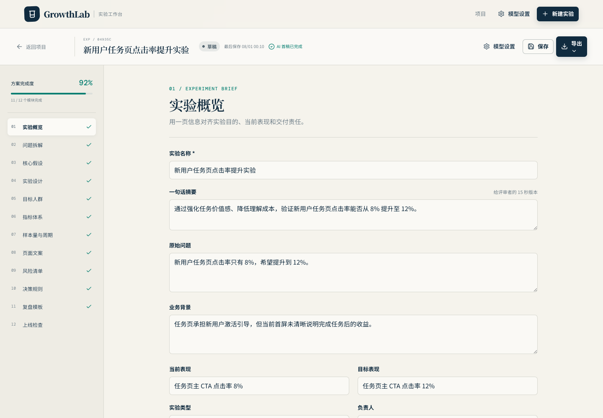

# GrowthLab — AI 增长实验工作台

<p align="center">
  把模糊的增长问题，转化为结构化、可编辑、可验证、可导出的实验方案。
</p>

<p align="center">
  <a href="https://tinylion1024.github.io/GrowthLab/"><strong>在线体验</strong></a>
  ·
  <a href="README.en.md">English</a>
  ·
  <a href="https://github.com/tinylion1024/GrowthLab/issues">反馈建议</a>
</p>

<p align="center">
  <a href="https://tinylion1024.github.io/GrowthLab/"></a>
  <a href="https://github.com/tinylion1024/GrowthLab/actions/workflows/deploy-pages.yml"></a>
  
  
</p>

GrowthLab 面向产品经理、增长团队、独立开发者和营销团队，帮助你系统完成增长实验设计、A/B 测试规划与实验文档交付。无需注册或配置模型，打开在线版本并点击“使用示例体验”，即可在浏览器中体验完整工作流。

> 如果 GrowthLab 对你有帮助，欢迎点一个 Star。你的支持会让更多正在做产品增长和实验设计的人发现它。

## 项目预览

[](https://tinylion1024.github.io/GrowthLab/)

截图使用内置 Demo 数据，不包含真实业务信息或 API 凭据。

## GrowthLab 解决什么问题？

一次可靠的增长实验不只有“一条假设”。它还需要目标人群、成功指标、样本量、实验周期、风险控制、决策规则和复盘模板。通用 AI 对话往往给出一段难以继续维护的文本，而 GrowthLab 把这些内容组织成 12 个可独立编辑的实验模块，并提供确定性的统计计算与可交付导出。

| 常见痛点 | GrowthLab 的处理方式 |
| --- | --- |
| 增长问题模糊，不知道如何拆解 | 从问题分析、核心假设到实验设计逐步结构化 |
| AI 输出格式漂移、遗漏关键字段 | JSON 解析与 Zod 校验，失败时提供可定位的反馈 |
| A/B 测试样本量靠经验猜测 | 提供两独立样本比例的确定性样本量与周期估算 |
| 方案散落在对话和文档里 | 浏览器本地项目、自动保存、Markdown 与 JSON 导出 |
| 担心业务数据或密钥泄露 | 本地优先存储，API Key 不进入项目数据或导出文件 |

## 60 秒体验

1. 打开 [GrowthLab 在线 Demo](https://tinylion1024.github.io/GrowthLab/)。
2. 点击“使用示例体验”，载入一份完整增长实验。
3. 浏览并编辑问题、假设、实验设计、指标、样本量、文案、风险和上线检查。
4. 导出 Markdown 实验方案，或下载 JSON 备份继续维护。

需要 AI 生成时，在右上角“模型设置”中连接兼容 OpenAI Chat Completions 的服务；不配置模型也能使用 Demo、本地编辑、统计计算和导出功能。

## 核心能力

- **结构化实验设计**：覆盖问题拆解、核心假设、实验设计、目标人群、指标、样本量、文案、风险、决策规则、上线检查和复盘模板。
- **BYOK AI**：支持自定义 API Base URL、模型、请求路径、Temperature、最大输出 Token 和 JSON Mode。
- **可靠输出校验**：模型响应先解析 JSON，再由 Zod 校验；错误信息和原始响应会在展示前脱敏。
- **A/B 测试规划**：计算两独立样本比例的样本量，支持单/双侧检验、不等分流和多个实验组。
- **本地项目管理**：支持创建、重命名、复制、删除、搜索、自动保存和损坏数据恢复。
- **实验方案交付**：一键复制或下载 Markdown，导入或导出 JSON 项目备份。
- **响应式体验**：桌面双栏、移动端单栏，并提供基础键盘焦点、跳转链接、ARIA 和减少动画偏好支持。

## 适合谁？

- 想快速验证激活、留存、转化或收入假设的产品与增长团队。
- 需要规范 A/B 测试设计、样本量和决策规则的数据与实验团队。
- 正在验证产品市场匹配、定价、落地页或 onboarding 的独立开发者。
- 希望把 AI 从“给建议”升级为“产出可执行实验文档”的团队。

## 技术栈

| 领域 | 方案 |
| --- | --- |
| 前端 | React 19、TypeScript、Vite 7、Tailwind CSS 4 |
| 表单与状态 | React Hook Form、Zustand |
| 数据校验 | Zod |
| 测试与质量 | Vitest、Testing Library、ESLint、TypeScript |
| 部署 | GitHub Actions、GitHub Pages |

## 本地开发

需要 Node.js 20 或更新版本。

```bash
git clone https://github.com/tinylion1024/GrowthLab.git
cd GrowthLab
npm install
npm run dev
```

常用校验：

```bash
npm run typecheck
npm run lint
npm test
npm run build
```

生产产物输出到 `dist/`，可由任意静态文件服务器托管。

## 模型配置

在页面右上角打开“模型设置”，填写：

- API Base URL，例如 `https://api.openai.com/v1`
- API Key
- 模型名称
- 可选的 Chat Completions Path、Temperature、最大输出 Token 和 JSON Mode

API Key 只保存在内存和当前会话的 `sessionStorage`，不会进入实验数据、`localStorage`、导出文件、源码或 GitHub Actions。选择“记住非敏感设置”时，仅持久化 Base URL、模型名称和 Temperature。

浏览器直连要求模型服务商允许当前站点的 CORS。公共多用户生产环境不应向前端分发平台密钥，应改用可信的 serverless API proxy。

## 样本量计算边界

内置计算器适用于两独立样本比例的规划估算，支持单/双侧检验、不等分流和多个实验组。结果不替代正式统计评审；实验应覆盖完整业务周期，不应因为短期显著随意提前停止。连续型指标需要历史均值和方差，GrowthLab 不会在缺少参数时伪造精确样本量。

## 常见问题

### GrowthLab 是什么？

GrowthLab 是一个本地优先的 AI 增长实验工作台，用于把增长问题转化为结构化的实验设计、A/B 测试计划和可导出的实验文档。

### GrowthLab 可以免费使用吗？

可以。在线 Demo、本地编辑、统计计算和导出功能无需账号。AI 生成功能使用你自行配置的兼容模型服务，相关费用由对应服务商决定。

### 数据会上传到 GrowthLab 服务器吗？

不会。GrowthLab 是纯静态前端，实验项目保存在当前浏览器的 `localStorage`。只有在你主动调用模型时，请求内容才会发送到你配置的模型服务商。

### GrowthLab 和通用 AI 对话有什么区别？

GrowthLab 提供固定的实验结构、字段校验、样本量计算、本地项目管理与标准化导出，更适合持续编辑和交付，而不只是生成一次性建议。

### 支持哪些 AI 模型？

支持提供 OpenAI Chat Completions 兼容接口且允许浏览器 CORS 请求的服务。你可以配置 Base URL、模型名和请求参数。

## 部署与安全

- GitHub Pages 工作流位于 `.github/workflows/deploy-pages.yml`，推送到 `main` 后执行类型检查、Lint、测试、构建与部署。
- Vite 在 GitHub Actions 中根据仓库名自动设置 Pages base path，本地开发使用 `/`。
- JSON 导入经过迁移和 Zod 结构校验，导出会递归剥离疑似密钥、Token、Authorization 和 Secret 字段。
- 仓库、项目数据、导出文件和 Pages 工作流均不包含 API Key。

当前站点：<https://tinylion1024.github.io/GrowthLab/>

## 参与项目

欢迎通过 [Issues](https://github.com/tinylion1024/GrowthLab/issues) 提交 bug、使用反馈和功能建议。如果你愿意帮助更多人发现 GrowthLab，也欢迎 Star、分享或 Fork 项目。

## 提交与发布

本项目遵循 Conventional Commits，并将变更拆成可独立审阅的原子提交。自动化代理不会执行 `git push`；确认本地提交后由人类手动推送：

```bash
git log --oneline --decorate -n 10
git push origin main
```
